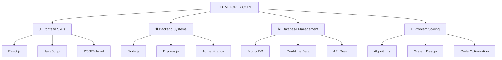

# ⚡ SYSTEM INITIALIZED ⚡

<div align="center">


<h2><code>[ACTIVE]</code> <b>FULL STACK DEVELOPER</b> <code></code></h2>

</div>

---

## 🔮 DEVELOPER PROFILE

<div align="center">

```bash
┌─[prabhat@dev-machine]─[~]
└──╼ $ cat /proc/developer_info
```

</div>

```yaml
developer:
  name: "Prabhat Yadav"
  role: "Full Stack Developer"
  version: "2024.8.15-stable"
  education: "B.Tech ECE @ MMMUT"
  experience: "3+ Years Coding"
  
expertise:
  problem_solving: "ADVANCED"
  web_development: "EXPERT"
  system_design: "INTERMEDIATE"
  algorithms: "PROFICIENT"

active_development:
  - "video_streaming_platform.js"
  - "realtime_chat_application.react"
  - "secure_authentication_system.node"
  - "algorithm_solutions.cpp"

technologies:
  frontend: ["React.js", "JavaScript ES6+", "HTML5", "CSS3/Tailwind"]
  backend: ["Node.js", "Express.js", "MongoDB", "JWT"]
  realtime: ["Socket.io", "WebRTC", "REST APIs"]
  tools: ["Git", "Postman", "VS Code", "Vercel"]
```

---

## 🚀 FEATURED PROJECTS

<div align="center">

<table>
<tr>
<td width="33%" align="center" valign="top">

### 🎥 VIDEOTUBE  
  
  
Scalable video sharing platform with secure authentication  
[**🔗 VIEW CODE**](https://github.com/prabhat60343/VideoStream1)
  
</td>
<td width="33%" align="center" valign="top">

### 💬 QUICKCHAT  
  
  
Real-time messaging app with instant communication  
[**🔗 VIEW CODE**](https://github.com/prabhat60343/QuickChat)
  
</td>
<td width="33%" align="center" valign="top">

### 🎬 STREAMIFY  
  
  
Advanced video streaming with HLS technology  
[**🔗 VIEW CODE**](https://github.com/prabhat60343/FullStack_VideoStreaming)
  
</td>
</tr>
</table>

</div>

---

## 🧠 TECHNOLOGY ARCHITECTURE

<div align="center">



</div>

---

## 🔧 SKILL MATRIX

<div align="center">

<table>
<tr>
<td valign="top">

```bash
┌─[FRONTEND_SKILLS]────────────┐
│ ⚛️  React.js      95%       │
│ ⚡ JavaScript     98%        │
│ 🎨 CSS3/Tailwind 90%        │
│ 📱 HTML5         97%        │
└──────────────────────────────┘
```

</td>
<td valign="top">

```bash
┌─[BACKEND_SKILLS]─────────────┐
│ 🟢 Node.js       92%         │
│ ⚡ Express.js    88%         │
│ 🍃 MongoDB       85%         │
│ 🔐 Authentication 90%        │
└──────────────────────────────┘
```

</td>
<td valign="top">

```bash
┌─[TOOLS & DEVOPS]─────────────┐
│ 📡 Socket.io     87%         │
│ 🔧 Git/GitHub    95%         │
│ 🚀 API Testing   89%         │
│ ☁️  Cloud Deploy 83%         │
└──────────────────────────────┘
```

</td>
</tr>
</table>

</div>

---

## 📊 PERFORMANCE METRICS

<div align="center">


</div>

---

## ⚡ PROBLEM SOLVING STATS

<div align="center">

```bash
╭─ LEETCODE_PROFILE ─────────────╮
│ 🧩 PROBLEMS_SOLVED: 200+      │
│ 🎯 SUCCESS_RATE:    85%       │
│ ⚡ RESPONSE_TIME:   <2s        │
│ 🏆 CURRENT_STATUS:  ACTIVE     │
╰────────────────────────────────╯
```

[](https://leetcode.com/u/prabhat60343/)

</div>

---

## 📋 DIGITAL RESUME

<div align="center">

<details>
<summary><strong>🔓 VIEW COMPLETE RESUME [CLICK TO EXPAND]</strong></summary>

<br/>

### 📡 RESUME VIEWER

```html
<!-- RESUME VIEWER IFRAME (GOOGLE DRIVE PDF) -->
<iframe 
    src="https://drive.google.com/file/d/1vVsDHsL0mXoo7thPhl5yLCES4gl-M-8I/preview" 
    width="100%" 
    height="600px" 
    frameborder="0"
    style="border: 2px solid #00ff41; border-radius: 10px; background: #0D1117;">
    🔄 Loading Resume... Please ensure JavaScript is enabled.
</iframe>
```

[](https://drive.google.com/file/d/1vVsDHsL0mXoo7thPhl5yLCES4gl-M-8I/view?usp=drive_link)

---

### 🔮 RESUME SUMMARY

```yaml
contact:
  name: "Prabhat Yadav"
  phone: "+91 9450854518"
  email: "py60343@gmail.com"
  location: "Gorakhpur, India 🇮🇳"
  profiles:
    github: "github.com/prabhat60343"
    linkedin: "linkedin.com/in/prabhat-yadav-428828257"
    leetcode: "leetcode.com/u/prabhat60343"

academic_background:
  current:
    degree: "B.Tech Electronics & Communication Engineering"
    institution: "MMMUT, Gorakhpur"
    duration: "2022-2026"
    cgpa: "7.04/10.0"
    status: "PURSUING"
  previous:
    - level: "Class XII (CBSE)"
      year: "2021"
      institution: "J.P. Education Academy, Gorakhpur"
      score: "87.4%"
    - level: "Class X (CBSE)"
      year: "2019"
      institution: "J.P. Education Academy, Gorakhpur"
      score: "92.2%"

accomplishments:
  - "✅ 200+ LeetCode Problems Solved"
  - "🎯 JEE Mains 2022 - AIR 74,478"
  - "📜 NPTEL: Introduction to IoT - IIT Kharagpur"
  - "📜 NPTEL: Semiconductor Devices - IISc Bangalore"

technology_stack:
  programming_languages: ["C/C++", "JavaScript ES6+"]
  frontend_development:
    - "HTML5 (Semantic Web)"
    - "CSS3 (Grid/Flexbox)"
    - "JavaScript (Modern ES6+)"
    - "React.js (Hooks/Context)"
    - "Redux Toolkit (State Management)"
    - "Tailwind CSS (Utility-first)"
  backend_development:
    - "Node.js (Runtime Environment)"
    - "Express.js (Web Framework)"
    - "RESTful APIs (Architecture)"
    - "JWT Authentication"
    - "Socket.io (Real-time Communication)"
  database_management: ["MongoDB (NoSQL Database)"]
  development_tools:
    - "Git/GitHub (Version Control)"
    - "VS Code (IDE)"
    - "Postman (API Testing)"
    - "Vercel (Deployment Platform)"
    - "FFmpeg (Video Processing)"
    - "Cloudinary (Media Management)"
  core_concepts: ["Data Structures & Algorithms", "Object-Oriented Programming", "System Design"]
  soft_skills:
    - "Problem Solving"
    - "Communication"
    - "Leadership"
    - "Analytical Thinking"
```

</details>

</div>

---

## 🎯 PROJECT SHOWCASE

<div align="center">

```bash
╭─ PROJECT_STATUS ───────────────╮
│ 🎥 VideoTube      [100% ✅]    │
│   • JWT Auth      SECURE       │
│   • Streaming     OPTIMIZED    │
│   • APIs          SCALABLE     │
│ 💬 QuickChat      [100% ✅]    │
│   • Real-time     CONNECTED    │
│   • MERN Stack    MODERN       │
│   • Media Share   EFFICIENT    │
│ 🎬 Streamify      [100% ✅]    │
│   • FFmpeg        AUTOMATED    │
│   • HLS           ADAPTIVE     │
│   • Secure Upload VALIDATED    │
╰────────────────────────────────╯
```

</div>

---

## 🌐 CONNECT WITH ME

<div align="center">

[](https://linkedin.com/in/prabhat-yadav-428828257)
[](mailto:py60343@gmail.com)
[](https://leetcode.com/u/prabhat60343/)
[](tel:+919450854518)

```yaml
contact_info:
  email: "py60343@gmail.com"
  phone: "+91-9450854518"
  linkedin: "linkedin.com/in/prabhat-yadav-428828257"
  leetcode: "leetcode.com/u/prabhat60343"
  github: "github.com/prabhat60343"

availability:
  status: "OPEN_TO_OPPORTUNITIES"
  response_time: "WITHIN_2_HOURS"
  collaboration: "ALWAYS_WELCOME"
  learning_mode: "CONTINUOUS"
```

</div>

---

<div align="center">


**[SYSTEM_MESSAGE]** *Thanks for exploring my developer profile. Ready to build amazing things together!* **[END_SESSION]**

</div>
